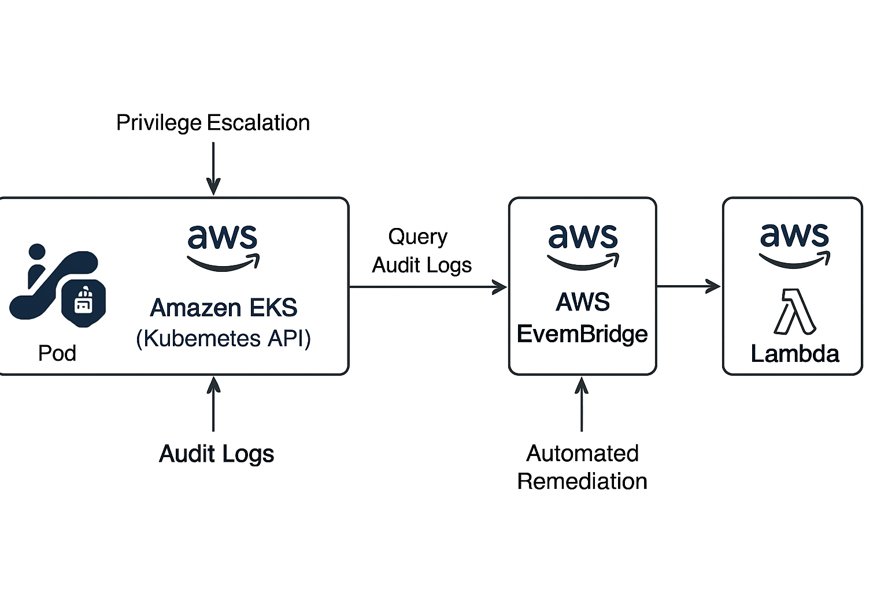

# AWS EKS Privilege Escalation Detection and Response Lab

This lab simulates a Kubernetes RBAC misconfiguration within Amazon EKS and demonstrates how to detect, respond, and document such incidents using AWS-native services. It aligns with key compliance frameworks such as NIST 800-53, CIS Controls v8, and ISO 27001.

---

## 📚 Table of Contents

- [Overview](#overview)
- [Architecture](#architecture)
- [Prerequisites](#prerequisites)
- [Lab Components](#lab-components)
- [Deployment Instructions](#deployment-instructions)
- [Validation Checklist](#validation-checklist)
- [Outputs](#outputs)
- [GRC Framework Mapping](#grc-framework-mapping)
- [Cleanup](#cleanup)
- [Troubleshooting](#troubleshooting)
- [References](#references)

---

## 🧭 Overview

This lab covers:

- Simulating a privilege escalation scenario via a misconfigured `ClusterRoleBinding` in EKS.
- Detecting escalation via CloudTrail logs, Athena queries, and GuardDuty.
- Automating response using AWS EventBridge and Lambda.
- Documenting the event with a validation checklist and assessment worksheet.

---

## 📐 Architecture



---

## ✅ Prerequisites

- AWS CLI and kubectl installed locally
- An active Amazon EKS cluster
- IAM permissions to deploy Lambda, EventBridge, GuardDuty, and Security Hub
- Athena and CloudTrail enabled
- CloudTrail logs sent to S3 and Athena query database configured
- Git installed to clone this repository

---

## 🧱 Lab Components

| Component | Purpose |
|:--|:--|
| `code/scripts/` | Athena SQL query, EventBridge rule, and Lambda remediation script |
| `manifests/` | Kubernetes RBAC misconfiguration and deployment manifests |
| `docs/` | Architecture diagram, validation checklist, assessment worksheet |
| `README.md` | Full documentation of the lab |

---

## 🚀 Deployment Instructions

### Step 1: Clone the Repository

```bash
git clone https://github.com/Runc9/eks-privilege-escalation-response-lab.git
cd eks-privilege-escalation-response-lab
